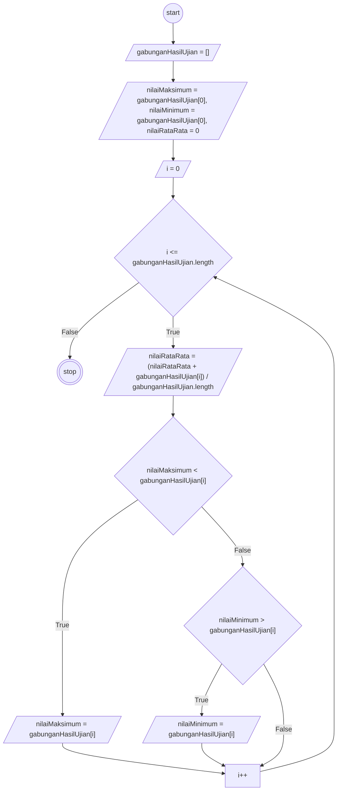

# Flowchart mencari nilai maksimum dan minimum

```mermaid
flowchart TD
start@{shape: circle, label: "start"}
input@{shape: lean-r, label: "gabunganHasilUjian = []"}
input2@{shape: lean-r, label: "nilaiMaksimum = gabunganHasilUjian[0], nilaiMinimum = gabunganHasilUjian[0], nilaiRataRata = 0"}
initLoop@{shape: lean-r, label: "i = 0"}
conditionLoop@{shape: diamond, label: "i <= gabunganHasilUjian.length"}
isNilaiMaksimumBigger@{shape: diamond, label: "nilaiMaksimum < gabunganHasilUjian[i]"}
nilaiMaksimum@{shape: lean-r, label: "nilaiMaksimum = gabunganHasilUjian[i]"}
pengubah@{shape: rect, label: i++}
stop@{shape: dbl-circ, label: "stop"}
isNilaiMinimumLower@{shape: diamond, label: "nilaiMinimum > gabunganHasilUjian[i]"}
nilaiMinimum@{shape: lean-r, label: "nilaiMinimum = gabunganHasilUjian[i]"}
nilaiRataRata@{shape: lean-r, label: "nilaiRataRata = (nilaiRataRata + gabunganHasilUjian[i]) / gabunganHasilUjian.length"}


start-->input
input-->input2
input2-->initLoop
initLoop-->conditionLoop
conditionLoop--True-->nilaiRataRata
nilaiRataRata-->isNilaiMaksimumBigger
conditionLoop--False-->stop
isNilaiMaksimumBigger--True-->nilaiMaksimum
nilaiMaksimum-->pengubah
pengubah-->conditionLoop
isNilaiMaksimumBigger--False-->isNilaiMinimumLower
isNilaiMinimumLower--True-->nilaiMinimum
nilaiMinimum-->pengubah
isNilaiMinimumLower--False-->pengubah

```